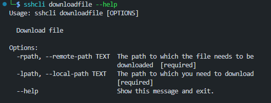
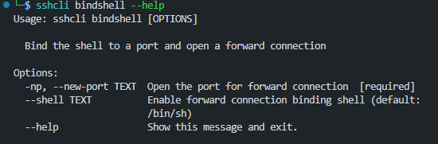
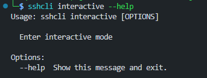
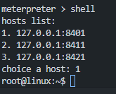
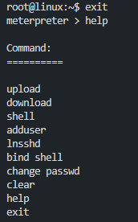

## SSH CLI

### Introduction

When managing SSH connections in batch processing, it can be troublesome, or in certain cases, weak SSH passwords might be a concern. In any case, being able to execute commands on multiple SSH hosts at once is quite important (I think). This is why this tool exists: **SSH CLI**.

**The Chinese version shall prevail !**

### Installation

Clone it from Git or download via `pip`:

```bash
git clone https://github.com/c0mentropy/sshcli.git
cd ./sshcli
pip install .
```

Alternatively, you can download the `tar.gz` file from the Releases section and install it via `pip`:

```bash
wget -c https://github.com/c0mentropy/sshcli/releases/download/v1.0.6/sshcli-1.0.6.tar.gz
pip install sshcli-1.0.6.tar.gz
```

### Description

This script is built on the `asyncssh` library for asynchronous SSH connections. Since this is just an early version, the functionality of `SSH CLI V1.0.0` is not very extensive. Below is an outline of its features:

```bash
 sshcli --help
```


#### Parameters:

```bash
--hosts-file    # File containing a list of hosts to connect to in the format: ip:port
--username      # SSH login username for all hosts
--password      # SSH login password for all hosts
--port          # Port to use if the hosts file does not include port information
--timeout       # Timeout for command execution to prevent hanging on any particular command
```

Since this tool uses `click` for the command-line interface, the `click` documentation will show commands in alphabetical order. Thus, the order of commands in the README might not align with the order shown in the command help.

### Modules

#### Upload File

This is a module for uploading files to remote hosts.

```bash
sshcli uploadfile --help
```


#### Parameters:

```bash
--local-path   # Local file path to be uploaded
--remote-path  # Remote server path where the file will be uploaded
```

#### Download File

Similar to the Upload File module, this module allows you to download files from remote hosts.

```bash
sshcli downloadfile --help
```



#### Parameters:

```bash
--remote-path  # Remote server path to download from
--local-path   # Local path to save the downloaded file
```

**Note**: When downloading files in batch SSH connections, to avoid file conflicts, the tool creates a folder for each host under the specified save path and stores the downloaded files in these folders.

#### Add User

This module allows you to add new users to remote hosts.

```bash
sshcli adduser --help
```


#### Parameters:

```bash
--new-username     # The username for the new user
--new-password     # The password for the new user
--root / --no-root # To create a user with root privileges, or a regular user
```

#### Change Password

This module allows you to change a user's password.

```bash
sshcli changepassword --help
```


#### Parameters:

```bash
--new-password # The new password
--user         # The username whose password needs to be changed
```

#### Bind Shell

This module is for binding a shell to a specific port.

```bash
sshcli bindshell --help
```



#### Parameters:

```bash
--new-port # The port to bind the shell
--shell    # The type of shell to bind
```

**Note**: The reason why reverse shells are not implemented in this tool is because, when handling batch SSH connections, how would the receiving end handle all the incoming connections? It would not make sense to bind all reverse shells to the same port. However, if reverse shells are needed, I have another lightweight tool written in Golang that can be used in conjunction with this one.

#### Ln sshd

This module creates a symbolic link for `sshd` to a file named `su` and binds it to a port, enabling SSH login without a password.

```bash
sshcli lnsshd --help
```


#### Parameters:

```bash
--new-port # Port to bind the symbolic link to
--path     # The path to create the symbolic link for `sshd`
```

#### Interactive

This module establishes an interactive session.

```bash
sshcli interactive --help
```



In the interactive mode, the logic is as follows: all SSH connections are first established asynchronously and saved in a dictionary of `conn` objects. Then, you can interact with each host in a manner similar to the command-line interface. For more detailed usage, please refer to the image below:



To exit the interactive shell and return to the main control interface, use `exit`.



#### Command  Server

There is a static link tool, **command_server**, in the server directory. See this directory for details on its functions.