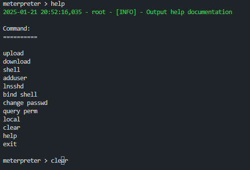
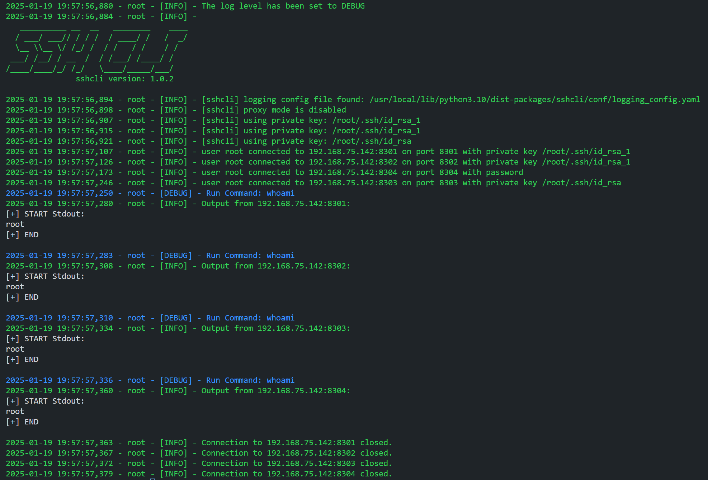
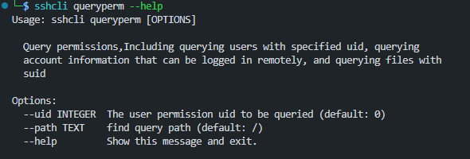

# 版本信息


## Version 1.0.5

### 完善API接口

重写了识别api的部分，在sshcli类中，函数名定义为：`run_function_name`即以`run_`起始的方法都自动生成api接口。

示例：

```python
#!/usr/bin/python3
# -*- coding: utf-8 -*-

from sshcli import SSHCli

if __name__ == '__main__':
    sshcli = SSHCli(hosts_file="./hosts.json", log_level='debug')
    sshcli.api.interactive()

```


### 重构项目结构

在完善api接口，和完善手册输出的时候，添加了一些utils方法，所以重构了项目结构，方便扩展。

## Version 1.0.4

### 伪终端

提供了一个良好的伪终端交互界面


长度适配：

>   这里可以发现，选择session的时候可以输入id，也可输入host的值。


### API

提供api模式调用，方便使用。（注：目前仅开放了interactive的api）

示例：

```python
from sshcli.cli import SSHCli

if __name__ == '__main__':
    sshcli = SSHCli(hosts_file="./hosts.json", log_level='debug')
    sshcli.api_interactive()
```


### 输入

在部分输入交互处，提供良好的输入交互系统，可以使用"上、下"查找上次的输入，也可以左右移动更改命令等。

示例1：



示例2：


## Version 1.0.3

修复了部分已知的bug，重新建库。

## Version 1.0.2

增加执行命令功能模块。

### Exec

```bash
sshcli -hf ./hosts.json exec -cmd whoami
```


示例：



### 其余更新

- 增加部分格式传递方法，如：json，网段等
- 增加密钥登录
- 增加proxy代理

### 示例

由于命令较为繁琐，所以这里给出一些常用示例，方便使用。

首先，所有各自命令都有自己的help帮助文档，可自行查看参数，使用方法基本类似，不一一举例说明。

#### 使用ip段和固定端口传递

```bash
sshcli -ns 172.17.0.2/29 -name root -pwd root123 -level debug --proxy interactive
```


**注：**爆红的error是这两个ip的容器不存在，所以失败了。

#### 使用json传递

**强烈建议**使用`.json`格式文件当作hosts file传递。

```bash
 sshcli -hf ./hosts.json -level debug interactive
```


hosts.json示例：

```json
{
    "192.168.75.142:8301": {
        "username": "root",
        "password": "",
        "private_key_path": "/root/.ssh/id_rsa_1"
    },
    "192.168.75.142:8302": {
        "username": "root",
        "password": "",
        "private_key_path": "/root/.ssh/id_rsa_1"
    },
    "192.168.75.142:8303": {
        "username": "root",
        "password": "admin123",
        "private_key_path": "/root/.ssh/id_rsa"
    },
    "192.168.75.142:8304": {
        "username": "root",
        "password": "root123",
        "private_key_path": ""
    }
}
```

文件说明：

- 如果private_key_path为空字符串，则会使用用户名密码的形式，此时password就是密码。
- 如果存在private_key_path字段，则password字段为密钥登录时候的passphrase验证，无需验证则留空。
- 如果省略端口，则为默认的22端口，当然也可以`-port`指定固定端口。


#### 使用txt传递 && 保存数据

通过`.txt`等其他方式传递时，可以save保存成`.json`文件

```bash
sshcli -hf ./hosts.txt -name root -pwd root123 -level debug --save -save-udf tests_save.json interactive
```


hosts.txt示例：

```tex
192.168.75.142:8301
192.168.75.142:8302
192.168.75.142:8303
192.168.75.142:8304
```


保存后的tests_save.json是：

```json
{
    "192.168.75.142:8301": {
        "username": "root",
        "password": "root123",
        "private_key_path": ""
    },
    "192.168.75.142:8302": {
        "username": "root",
        "password": "root123",
        "private_key_path": ""
    },
    "192.168.75.142:8303": {
        "username": "root",
        "password": "root123",
        "private_key_path": ""
    },
    "192.168.75.142:8304": {
        "username": "root",
        "password": "root123",
        "private_key_path": ""
    }
}
```


#### 使用proxy代理

这里会从配置文件中读取，或者从环境变量中读取代理配置。也可以结合其他代理工具使用如proxychains4

```bash
sshcli -hf ./proxy_hosts.json -level debug --proxy interactive
```


```bash
p4 sshcli -hf ./proxy_hosts.json -level debug interactive
```


proxy_hosts.json示例：

```json
{
    "172.17.0.2:22": {
        "username": "root",
        "password": "root123",
        "private_key_path": ""
    },
    "172.17.0.3:22": {
        "username": "root",
        "password": "root123",
        "private_key_path": ""
    },
    "172.17.0.4:22": {
        "username": "root",
        "password": "root123",
        "private_key_path": ""
    },
    "172.17.0.5:22": {
        "username": "root",
        "password": "root123",
        "private_key_path": ""
    }
}
```

## Version 1.0.1

### Log and Other

增加了日志系统， 修改了冗余代码和部分bug。

### Query permissions

```bash
sshcli queryperm --help
```



示例：


## Version 1.0.0

​       该脚本基于`asyncssh`库实现的异步`ssh`连接处理。由于这仅仅只是一个雏形，所以**SSH CLI V1.0.0**的功能并不是很多。具体如下：

```bash
sshcli --help
```


param：

```bash
--hosts-file # 需要批量连接的hosts文件，默认格式为：ip:port
--username   # 需要批量连接的ssh登录用户名
--password   # 需要批量连接的ssh登录的密码
--port       # 如果hosts文件中的格式为：ip，没有端口，则会使用该参数统一设置端口
--timeout    # 执行命令的timeout，避免由于某个命令卡住而导致后续无法进行
```


由于该工具我选择使用click来实现，click提供的help文档的Commands顺序是按字母排序的。所以我按照我实现的顺序来编写README，和上述脚本运行的帮助文档顺序不同还望见谅。

### Upload File

顾名思义，这是一个上传文件模块。

```bash
sshcli uploadfile --help
```


param：

```bash
--local-path  # 是需要上传的本地文件路径
--remote-path # 是上传到远程服务器的路径
```

### Download File

同`Upload File`，这是一个下载文件模块。


param：

```bash
--remote-path # 是下载的远程服务器的路径
--local-path  # 是需要下载到本地文件路径
```

**注**： 与上传文件不同的是，在处理批量`ssh`连接时，如果要批量下载某种配置文件等，则为了避免文件冲突，所以在选择完保存路径之后，会在该路径下创建对应host名称的文件夹，下载后存放在对应的文件夹下。

### Add User

这是一个创建新用户的模块。

```bash
sshcli adduser --help
```


param：

```bash
--new-username     # 创建新用户的用户名
--new-password     # 创建新用户的密码
--root / --no-root # 创建root权限用户，或者普通用户
```

### Change Password

这是一个更改用户密码的模块。

```bash
sshcli changepassword --help
```


param：

```bash
--new-password # 更改后的新密码
--user         # 需要更改密码的用户名
```

### Bind Shell

这是一个绑定正向连接的模块。

```bash
sshcli bindshell --help
```


param：

```bash
--new-port # 绑定一个shell到指定端口
--shell    # 需要绑定的shell类型
```

**补充**：为什么没有做反弹shell，原因是批量处理的时候，接收端口应该怎么做呢，总不能全弹到同一个端口上吧。但不影响，如果需要反弹shell，我还有另外一个基于`golang`写的轻量化工具。可以配合使用。

### Ln sshd

这是一个建立软连接的模块，是将`sshd`软连接到一个名为`su`的文件上，再绑定该程序到一个端口上，即可实现任意密码登录`ssh`。

```bash
sshcli lnsshd --help
```


param：

```bash
--new-port # 将软连接的su绑定一个指定端口
--path     # 将sshd软连接到哪个路径下
```

### Interactive

这是一个建立交互的模块。

```bash
sshcli interactive --help
```


进入交互模块，实现的逻辑是，首先通过异步连接先将所有`ssh`连接成`conn`对象字典保存起来，然后进行交互操作。具体的使用方式和命令行类似，详见下图


通过help查看命令帮助列表，其中会多一个shell功能，是选择一个host进入shell**单独**操作。


通过exit退出该shell，回到统一控制界面。


