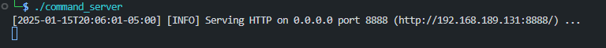
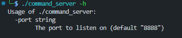
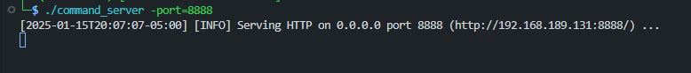
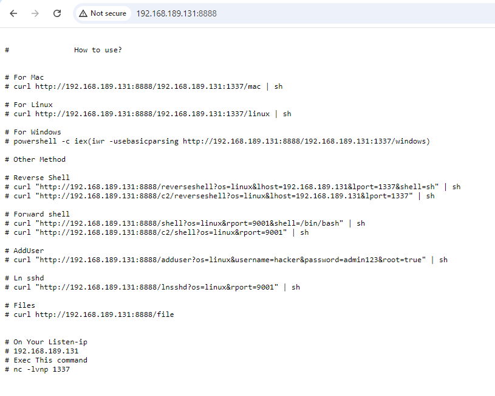

# Command Server


## 前言

在每次执行反弹shell或者其他命令时，或因命令很复杂很难记住需要每次查看，或因命令不存在要用其他的一个一个试很麻烦。所以有了写一个server的打算，即**Command Server**


## 简介


### 运行

```bash
./command_server
```




运行后默认为8888端口，可以-port指定端口。






### Index

访问index页面，可以看到完整的使用手册。



然后根据提示，使用对应的命令即可，基本上仅需要远程有`curl`即可。其中在`/file`路由下，还有一些其他脚本文件或者命令文档。其余功能不过多赘述，与**sshcli**类似。

